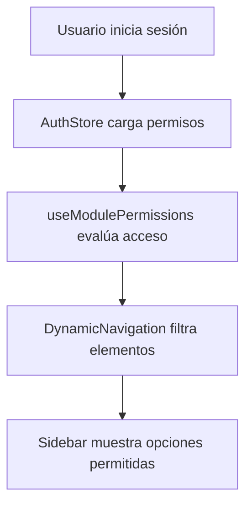
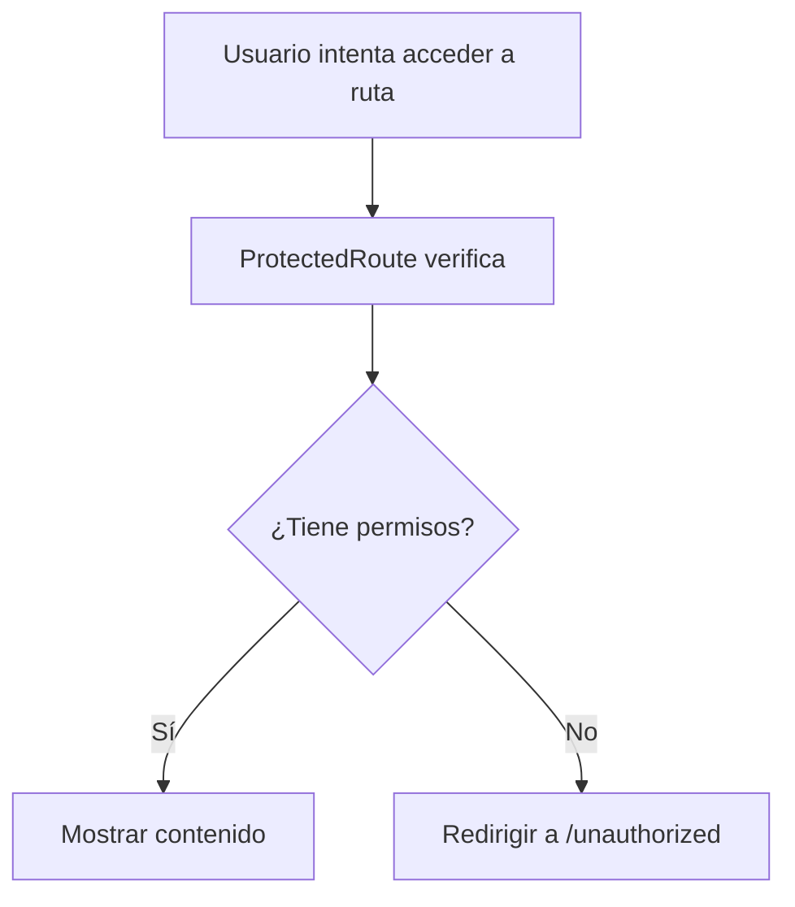

# Sistema de Navegación Dinámica con Permisos

## Resumen

Se ha implementado un sistema de navegación dinámica que filtra automáticamente los elementos del sidebar basándose en los permisos del usuario actual. Esto asegura que los usuarios solo vean los módulos y funcionalidades a los que tienen acceso.

## Componentes Implementados

### 1. Hook de Permisos (`/hooks/usePermissions.ts`)

#### `useModulePermissions()`

- **Propósito**: Determina qué módulos y secciones administrativas puede ver el usuario
- **Retorna**:
  - `allowedModules`: Lista de módulos principales permitidos
  - `allowedAdminSections`: Secciones administrativas filtradas
  - `canAccessModuleWithPermissions()`: Función para verificar acceso a módulos
  - `isAdmin`: Si el usuario es administrador

#### `useFeaturePermissions()`

- **Propósito**: Verifica permisos específicos de funcionalidades
- **Retorna**: Objeto con métodos booleanos para verificar permisos específicos
  - `canCreateCases`, `canViewAllCases`, `canEditCases`, etc.

#### `useScopePermissions()`

- **Propósito**: Maneja permisos con scopes (own, team, all)
- **Funcionalidad**: Verificación contextual de permisos basada en propiedad

### 2. Navegación Dinámica (`/components/navigation/DynamicNavigation.tsx`)

#### Características:

- **Filtrado automático**: Solo muestra elementos permitidos
- **Iconos dinámicos**: Mapeo inteligente de iconos por nombre
- **Tooltips en modo colapsado**: Información completa en espacios reducidos
- **Indicadores de estado**: Muestra cuando no hay permisos disponibles

#### Estructura de Datos:

```typescript
interface ModulePermission {
  name: string;
  href: string;
  icon: string;
  permissions: string[];
  scope?: "own" | "team" | "all";
  adminOnly?: boolean;
}
```

### 3. Componentes de Protección

#### `ProtectedRoute`

- **Propósito**: Proteger rutas completas basándose en permisos
- **Parámetros**:
  - `requiredPermissions`: Array de permisos requeridos
  - `adminOnly`: Solo para administradores
  - `fallbackPath`: Ruta de redirección en caso de falta de permisos

#### `ConditionalRender`

- **Propósito**: Renderizado condicional de componentes
- **Uso**: Mostrar/ocultar elementos de UI basándose en permisos

#### `AdminRoute`

- **Propósito**: Atajo para rutas exclusivamente administrativas

### 4. Sistema de Autenticación Mejorado

#### Actualización del `authStore.ts`:

- **Permisos por rol**: Mapeo de permisos según el rol del usuario
- **Verificación de módulos**: Función `canAccessModule()` mejorada
- **Compatibilidad**: Mantiene API existente mientras agrega nuevas funcionalidades

## Configuración de Permisos

### Módulos del Sistema

```typescript
const SYSTEM_MODULES = [
  {
    name: "Dashboard",
    href: "/",
    icon: "HomeIcon",
    permissions: [], // Siempre visible
  },
  {
    name: "Casos",
    href: "/cases",
    icon: "DocumentTextIcon",
    permissions: ["cases.read_own", "cases.read_team", "cases.read_all"],
  },
  // ... más módulos
];
```

### Secciones Administrativas

```typescript
const ADMIN_SECTIONS = [
  {
    id: "user-management",
    title: "Administración",
    icon: "UsersIcon",
    adminOnly: true,
    items: [
      {
        name: "Usuarios",
        href: "/users",
        permissions: ["users.read_all", "users.admin_all"],
        adminOnly: true,
      },
      // ... más items
    ],
  },
];
```

## Convención de Nomenclatura de Permisos

### Formato: `{recurso}.{acción}_{scope}`

#### Recursos:

- `cases` - Casos
- `notes` - Notas
- `todos` - Tareas
- `dispositions` - Disposiciones
- `users` - Usuarios
- `roles` - Roles
- `config` - Configuración

#### Acciones:

- `read` - Leer/Ver
- `create` - Crear
- `update` - Actualizar
- `delete` - Eliminar
- `admin` - Administrar (todos los permisos)

#### Scopes:

- `own` - Solo recursos propios
- `team` - Recursos del equipo
- `all` - Todos los recursos

#### Ejemplos:

- `cases.read_own` - Ver casos propios
- `users.admin_all` - Administrar todos los usuarios
- `notes.update_team` - Editar notas del equipo

## Flujo de Trabajo

### 1. Inicialización



### 2. Verificación de Acceso



## Herramientas de Desarrollo

### PermissionIndicator

- **Propósito**: Debugging y desarrollo
- **Funcionalidades**:
  - Muestra permisos actuales del usuario
  - Lista módulos permitidos
  - Verifica permisos específicos
  - Solo visible en desarrollo

### UnauthorizedPage

- **Propósito**: Página de error para acceso denegado
- **Características**:
  - Mensaje claro de error
  - Opciones de navegación
  - Información de contacto

## Integración con Backend

### Endpoints Requeridos:

- `GET /api/permissions/user/current` - Permisos del usuario actual
- `GET /api/permissions/structure` - Estructura de módulos
- `POST /api/permissions/check` - Verificar permisos específicos

### Hook Backend (`useBackendPermissions`)

- **Propósito**: Conexión con API real de permisos
- **Estado**: Preparado para integración futura
- **Fallback**: Usa sistema local hasta conexión con backend

## Ventajas del Sistema

### Seguridad

- **Filtrado automático**: Usuarios no ven opciones no permitidas
- **Protección de rutas**: Verificación en cada acceso
- **Validación en frontend y backend**: Doble capa de seguridad

### Experiencia de Usuario

- **Interface limpia**: Solo elementos relevantes
- **Navegación intuitiva**: Agrupación lógica de funcionalidades
- **Feedback claro**: Indicadores de permisos limitados

### Mantenibilidad

- **Configuración centralizada**: Fácil modificación de permisos
- **Componentes reutilizables**: Protección aplicable en cualquier lugar
- **Sistema extensible**: Fácil agregar nuevos módulos y permisos

## Próximos Pasos

### 1. Integración Backend

- Implementar endpoints de permisos en backend
- Conectar `useBackendPermissions` con API real
- Sincronizar permisos en tiempo real

### 2. Funcionalidades Avanzadas

- Permisos contextuales dinámicos
- Sistema de equipos (team scope)
- Caché de permisos
- Logs de acceso

### 3. Testing

- Tests unitarios para hooks de permisos
- Tests de integración para navegación
- Tests E2E para flujo completo de permisos

## Uso Práctico

### Proteger una Ruta

```tsx
<ProtectedRoute requiredPermissions={["users.read_all"]} adminOnly={true}>
  <UsersPage />
</ProtectedRoute>
```

### Renderizado Condicional

```tsx
<ConditionalRender permissions={["cases.create_own", "cases.create_all"]}>
  <CreateCaseButton />
</ConditionalRender>
```

### Verificación Programática

```tsx
const { checkPermission } = usePermissionCheck();

if (checkPermission("cases.delete_own")) {
  // Mostrar botón de eliminar
}
```

Este sistema proporciona una base sólida y extensible para manejar permisos y navegación dinámica en el frontend, asegurando tanto la seguridad como una excelente experiencia de usuario.
